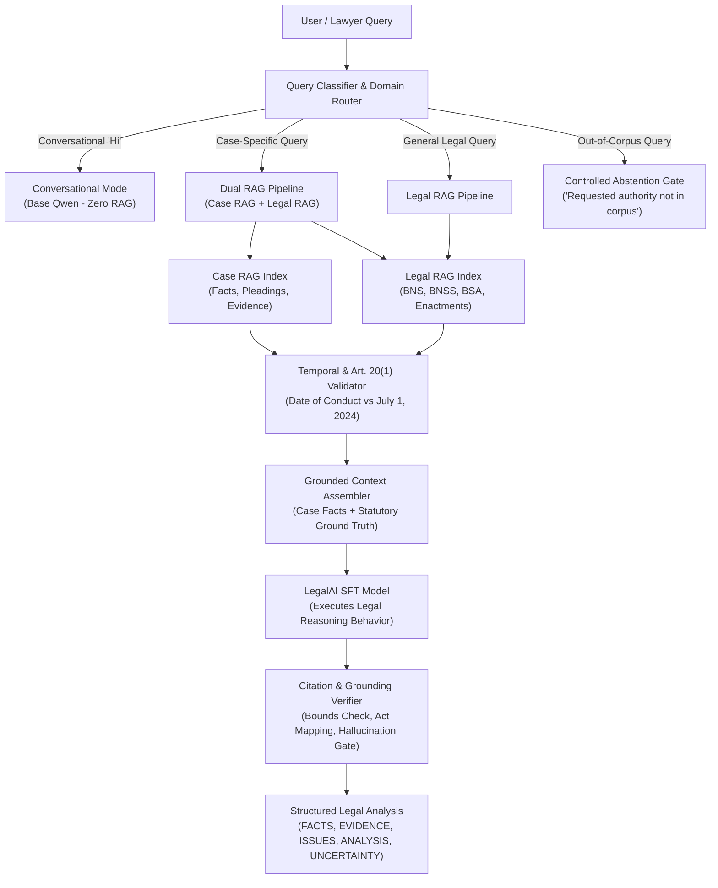
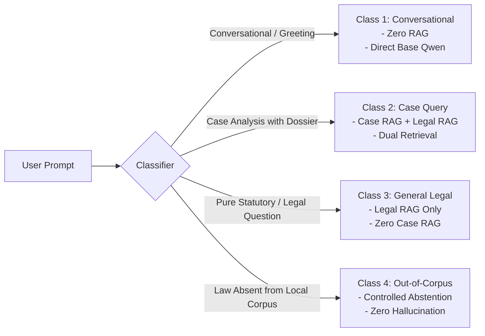

# LegalAI Final Reasoning Architecture: Fine-Tuning & RAG Separation

**Version:** 2.0  
**Status:** Canonical Architectural Specification  
**Scope:** Separation of Model Parametric Capabilities (Legal Reasoning) from External Non-Parametric Authority (Authoritative Legal RAG & Case RAG)  

---

## 1. Executive Summary & Core Principle

In LegalAI, **a training dataset answer is never treated as the authoritative legal ground truth.** 

Statutes change, enactments are repealed, section numbers shift across legislative overhauls (such as the transition from IPC/CrPC/IEA to BNS/BNSS/BSA), and dataset answers can carry historical obsolescence, clerical errors, or localized inaccuracies.

Therefore, LegalAI enforces a strict architectural bifurcation:
- **Fine-Tuning (Parametric Memory)** teaches **HOW to think through a lawyer's case**—legal grammar, evidentiary scrutiny, issue spotting, structured argumentation, and epistemic honesty.
- **Legal RAG (Non-Parametric Memory)** provides **WHAT the law currently is**—verbatim sections, statutory bounds, rules, amendments, commencement dates, and binding judicial precedents.
- **Case RAG (Episodic Memory)** provides **WHAT happened in this specific dispute**—pleadings, affidavits, witness depositions, exhibits, and procedural records.



---

## 2. Fine-Tuning Role: The Legal Reasoning Engine

Fine-tuning (SFT / LoRA) is **strictly behavioral and pedagogical**. It shapes the cognitive style, procedural discipline, and analytical structure of the language model without treating its internal weights as a static statutory database.

### What Fine-Tuning MUST Teach
1. **Legal Terminology & Register**: Understanding terms of art (*ad-interim*, *sine qua non*, *locus standi*, *res judicata*, *prima facie*, *suo motu*).
2. **Lawyer-Style Deductive Reasoning**: Applying legal tests (e.g. tests for grant of bail, ingredients of cheating, requirements for injunction).
3. **Case Analysis Methodology**: Dissecting disputes across the 24 canonical tasks (`CA01_CASE_OVERVIEW` through `CA24_CASE_STRATEGY`).
4. **Evidentiary Scrutiny**: Weighing primary vs secondary evidence, oral vs documentary proof, and examining chain of custody.
5. **Contradiction & Variance Detection**: Spotting internal discrepancies between depositions, prior written notices, and pleadings.
6. **Structured Argument Construction**: Adhering strictly to the 8-part argument schema:
   $$\text{Argument} \to \text{Facts} \to \text{Evidence} \to \text{Law} \to \text{Reasoning} \to \text{Counterargument} \to \text{Response} \to \text{Uncertainty}$$
7. **Anticipation of Adversary Counterarguments**: Formulating robust rebuttals and stress-testing our own case theory.
8. **Epistemic Honesty & Uncertainty Handling**: Clearly identifying open legal questions, divergent High Court rulings, and factual ambiguities.
9. **Missing-Information Detection**: Refusing to invent missing details and explicitly asserting:
   > *"The supplied case material does not establish this."*
10. **Fact vs. Inference Separation**: Rigorously distinguishing what is physically established on record from what is argued as a legal inference.
11. **Structured Lawyer-Oriented Output**: Generating organized responses with clean headings: `FACTS`, `EVIDENCE`, `LEGAL ISSUES`, `ANALYSIS`, `ARGUMENTS`, `COUNTERARGUMENTS`, `UNCERTAINTY`, `NEXT STEPS`.
12. **Temporal-Law Awareness**: Knowing that substantive criminal law attaches to the date of conduct, respecting Article 20(1) non-retroactivity and transitional savings (e.g. Section 531 BNSS).
13. **Refusal to Invent Authorities**: Refusing to hallucinate case citations, reporter volumes (*AIR*, *SCC*), or non-existent sections.

### What Fine-Tuning Must NEVER Be Relied On For
- **Memorized Statutory Text**: The model must never generate verbatim statutory text from parametric memory when authoritative retrieval is active.
- **Statutory Cross-References**: Parametric memory must not override the concordance or section registry of the RAG system.
- **Final Determination of Repeal / Currency**: An old fine-tuning sample citing IPC 420 must never be used as evidence that IPC remains current law for post-July 1, 2024 offences.

---

## 3. Authoritative Legal RAG Role: The Single Source of Truth

The Legal RAG system is the **authoritative, non-negotiable statutory repository**. It holds verified, official legislative enactments and binding judicial precedents.

### Contents of the Authoritative Legal RAG
- **Current Official Sanhitas / Statutes**: Full text of BNS (358 sections), BNSS (531 sections), BSA (170 sections), and active Central/State Acts.
- **Section Boundaries & Headings**: Absolute statutory ceilings and verbatim titles preventing out-of-bounds hallucinations (e.g. BNS terminates at Sec 358; BSA terminates at Sec 170).
- **Statutory Concordance**: Formal cross-mappings between legacy codes and modern enactments (IPC $\leftrightarrow$ BNS, CrPC $\leftrightarrow$ BNSS, IEA $\leftrightarrow$ BSA).
- **Enactment Metadata**:
  - Date of Presidential Assent
  - Official Gazette Notification Date
  - Date of Commencement (e.g. July 1, 2024 for BNS, BNSS, BSA)
  - Repeal & Savings Provisions (e.g. Section 358 BNS, Section 531 BNSS)
- **Subordinate Legislation**: Rules, regulations, and official government circulars.
- **Authoritative Precedents**: Verified judgments of the Supreme Court of India and jurisdictional High Courts.

---

## 4. Case RAG Role: The Episodic Dispute Memory

In client matters and litigated disputes, the model operates on a distinct **Case RAG** index containing the specific case record.

| Dimension | Legal RAG | Case RAG |
| :--- | :--- | :--- |
| **Data Type** | Public statutes, rules, precedents | Client pleadings, exhibits, witness depositions, FIRs |
| **Scope** | Universal Indian Law | Private, matter-specific docket |
| **Confidentiality** | Public | Confidential / Privileged |
| **Update Frequency** | Legislative sessions & weekly law reports | Real-time as case documents are uploaded |
| **Retrieval Objective** | Find governing legal rule | Find operative facts, exhibits, and statements |

---

## 5. Query Routing & Classification Matrix

Every incoming user prompt is first evaluated by the **Legal Intent & Domain Router** before any retrieval or inference occurs:



### Detailed Routing Policies

| Query Class | Typical Prompt Examples | Case RAG | Legal RAG | Execution Policy |
| :--- | :--- | :---: | :---: | :--- |
| **1. Conversational** | *"Hi"*, *"Good morning"*, *"Who are you?"* | ❌ None | ❌ None | Direct conversational response from base model. Zero retrieval latency. |
| **2. Case-Specific** | *"What are our strongest arguments?"*, *"Review this draft"*, *"Identify evidence gaps in this FIR"* | ✅ Active | ✅ Active | **Dual Retrieval**: Extracts facts from Case RAG; retrieves governing statutes from Legal RAG. |
| **3. General Legal** | *"What is Section 138 of the NI Act?"*, *"What are the bail provisions under BNSS?"* | ❌ None | ✅ Active | **Statutory Retrieval**: Retrieves sections, commentary, and precedent from Legal RAG only. Case RAG is suppressed. |
| **4. Out-of-Corpus** | *"Explain Section 45 of the French Penal Code"*, *"Under the 1890 Probate Act..."* | ❌ None | ⚠️ Evaluated | **Controlled Abstention**: If the requested enactment is not ingested, immediately trigger the standardized refusal protocol. |

---

## 6. The Final 10-Step Answering Pipeline

When answering any substantive legal or case query, the system executes the following 10 steps sequentially:

```text
Step 1:  Classify Query (Intent, Domain, Task Type CA01-CA24)
Step 2:  Identify Case Context (Bind to Active Case Dossier if present)
Step 3:  Retrieve Relevant Case Documents (Dense Cosine + Sparse BM25 over Case RAG)
Step 4:  Retrieve Applicable Authoritative Law (FTS5 BM25 + BGE Dense Cosine + RRF over Legal RAG)
Step 5:  Validate Temporal Applicability (Date of Incident vs. July 1, 2024; Art. 20(1) Check)
Step 6:  Generate Grounded Analysis (Feed Grounded Prompt to SFT Legal Model)
Step 7:  Verify Citations (Extract Cited Sections; Check Bounds & Official Enactment Registry)
Step 8:  Check Factual Grounding (Ensure Every Factual Premise Traces to Case RAG)
Step 9:  Produce Structured Answer (FACTS, EVIDENCE, ISSUES, ANALYSIS, ARGUMENTS, NEXT STEPS)
Step 10: State Uncertainty & Missing Information ("The supplied case material does not establish this.")
```

### Deep Dive into Critical Steps

#### Step 5: Temporal Validation Protocol
Before prompting the model, the **Temporal Law Guard** extracts any dates mentioned in the case material:
- If an offence occurred **prior to July 1, 2024**:
  - Substantive liability must be governed by the **Indian Penal Code, 1860** (mandated by Article 20(1) Constitution of India).
  - The model is instructed **not** to charge the accused under BNS, but to cite IPC while noting corresponding BNS provisions for comparative reference.
- If proceedings or investigations are initiated **on or after July 1, 2024**:
  - Procedural actions follow the **Bharatiya Nagarik Suraksha Sanhita, 2023** subject to Section 531(2)(a) BNSS transitional savings for pending trials.

#### Step 7: Post-Generation Statutory Citation Verification
Every section number generated in the output is programmatically scanned:
1. **Bounds Check**: If the answer cites `Section 999 BNS` or `Section 375 BNS`, the verifier catches that BNS terminates at Section 358 and blocks/sanitizes the output.
2. **Anachronistic Statute Mixup**: If the answer cites `Section 65B of BSA`, the verifier flags the confabulation (electronic evidence in BSA is Section 63; 65B was IEA) and rejects the generation.
3. **Grounding Traceability**: If a cited section does not exist in the retrieved chunks, the citation is marked unverified.

#### Step 8 & 10: Factual Grounding & Epistemic Abstention
If the lawyer asks: *"Did the witness sign the seizure memo?"* and the case file does not mention the seizure memo:
- **Prohibited Behavior**: Assuming the memo was signed or inventing a witness name.
- **Mandated Behavior**:
  > *"The supplied case material does not establish whether the witness signed the seizure memo. This requires evidentiary verification from the original police diary."*

---

## 7. Controlled Abstention Protocol

When a user requests a statutory provision, regulation, or enactment that is not present in the authoritative Legal RAG:

> [!CAUTION]
> **Strict Prohibition Against Cross-Statute Substitution:**  
> The system must NEVER substitute a known statute (e.g. BNS) in place of an unavailable statute (e.g. DPDP Act, RERA, or foreign law) to "fill the gap."

### Mandatory Abstention Output
If the requested legal authority is outside the ingested corpus, the system returns:

```text
The requested authority is not currently available in the LegalAI legal corpus, so I cannot provide a grounded statutory answer from the available sources.
```

The system may then optionally list what authoritative materials *are* currently ingested (e.g. BNS, BNSS, BSA) and invite the user to query within those boundaries or upload the relevant statute.

---

## 8. Query Exemplars & Operational Behaviors

### Exemplar A: Case Analysis Query
- **User Query**: *"What are our strongest arguments against the charge of cheating?"*
- **Context**: Case Dossier bound (`CASE_LQ_0042`).
- **Pipeline Execution**:
  1. Case RAG retrieves the agreement, payment receipts, and WhatsApp communications showing commercial dispute.
  2. Legal RAG retrieves Section 318 BNS (cheating definition & punishment) and landmark Supreme Court rulings holding that breach of contract does not automatically constitute criminal cheating absent fraudulent intent at inception.
  3. Model outputs structured response:
     - `FACTS`: Chronology of commercial contract and payments.
     - `EVIDENCE`: Written invoices and bank records.
     - `LEGAL ISSUES`: Absence of dishonest intention at the time of making the promise.
     - `ARGUMENTS`: 8-part structured argument.
     - `COUNTERARGUMENTS`: Rebuttal to prosecution's claim of inducement.
     - `UNCERTAINTY`: *"The supplied case material does not establish whether a formal arbitration notice was served prior to the FIR."*

### Exemplar B: Pure Statutory Query
- **User Query**: *"What is the maximum period of police custody under Section 187 of BNSS?"*
- **Context**: Zero case context.
- **Pipeline Execution**:
  1. Router directs to Legal RAG only. Case RAG is disabled.
  2. Legal RAG retrieves Section 187 BNSS (corresponding to legacy Section 167 CrPC).
  3. Model explains the 15-day police custody window, the statutory flexibility to seek custody in parts during the initial 40 or 60 days, and the overall 60/90 day default bail threshold.
  4. Post-verifier validates that Section 187 BNSS exists and text matches official Sanhita.

### Exemplar C: Conversational Query
- **User Query**: *"Hello, can you help me prepare for court tomorrow?"*
- **Pipeline Execution**:
  1. Router identifies pure conversational intent.
  2. Zero RAG retrieval executed.
  3. Model responds promptly in conversational mode, explaining the case analysis capabilities available and asking the user to supply the case material or docket identifier.

---

## 9. Architectural Guarantees & Safeguards

1. **Frozen Model Weights**: SFT weights are treated as a reasoning engine, not an alterable statutory database.
2. **Retrieval Supremacy**: Authoritative statutory text retrieved from Legal RAG strictly overrides any conflicting parametric weights.
3. **Complete Case Isolation**: Dual-index retrieval ensures private client case materials in Case RAG never contaminate the public Legal RAG index.
4. **Audit Trail**: Every generated answer retains an internal audit trace logging:
   - Retrieved chunk IDs
   - Temporal validation decision
   - Citation verification log
   - Abstention gate status
