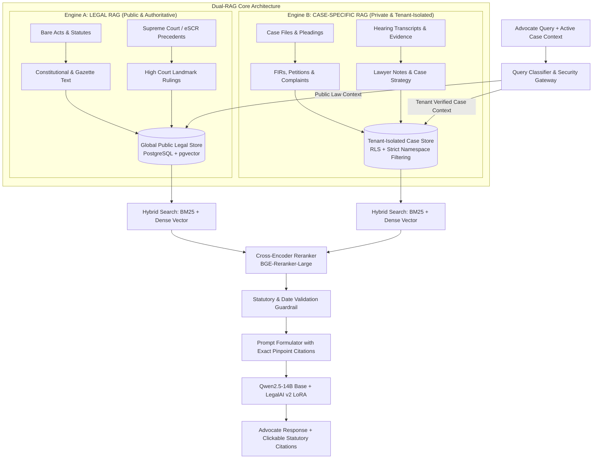

# LegalAI RAG Architecture: Dual-Engine Retrieval & Ingestion System

**Document Version:** 1.0.0  
**Target Platform:** Self-Hosted Enterprise Legal Intelligence Platform  
**Target Model:** `Qwen/Qwen2.5-14B-Instruct` + `outputs/qwen14b-legalai-v2`  
**Author:** LegalAI Architecture & Research Team  
**Status:** Approved Design Specification  

---

## 1. System Vision & Architecture Overview

LegalAI combines parameter-efficient domain fine-tuning (LoRA v2) with an authoritative Retrieval-Augmented Generation (RAG) subsystem. While LoRA fine-tuning provides deep domain reasoning, advocate-grade vocabulary, and procedural framing, RAG provides **cryptographically verified, real-time statutory grounding** and **tenant-isolated case intelligence**.



---

## 2. The Dual-RAG Architecture

To guarantee absolute data security while maximizing legal retrieval accuracy, the system is strictly bifurcated into two independent retrieval engines:

### A. LEGAL RAG (Public Authoritative Legal Engine)
* **Data Domain:** Indian Central and State Acts, Constitutional Articles, Central Gazette Notifications, Statutory Orders, Rules, Regulations, and reported Supreme Court / High Court precedents.
* **Access Scope:** Read-only, shared across all users and tenants.
* **Update Frequency:** Scheduled continuous synchronization with official Gazette releases and e-SCR publications.
* **Trust Requirement:** Sovereign truth. Requires 100% text fidelity with zero synthetic summarization of statutory text.

### B. CASE-SPECIFIC RAG (Private Tenant-Isolated Engine)
* **Data Domain:** Case pleadings, client FIRs, plaints, written statements, affidavits, deposition transcripts, interim orders, medical reports, and advocate strategy notes.
* **Access Scope:** Strictly private. Strict multi-tenant isolation ensures that **Lawyer A / Case 1 can never retrieve or observe even a single token from Lawyer B / Case 2**.
* **Update Frequency:** Event-driven; instantaneous ingestion upon advocate file upload.
* **Compliance Requirement:** Attorney-client privilege compliance (Section 126 of the Indian Evidence Act / Section 132 of Bharatiya Sakshya Adhiniyam, 2023).

### Strict Tenant-Isolation Guarantees
1. **Cryptographic Tenant Tagging:** Every document chunk in Case-Specific RAG is injected with mandatory metadata: `tenant_id` (lawyer/firm UUID) and `case_id` (individual brief UUID).
2. **PostgreSQL Row-Level Security (RLS):** At the database layer, every query executes with session variables:
   ```sql
   SET LOCAL app.current_tenant_id = 'tenant_uuid_123';
   SET LOCAL app.current_case_id = 'case_uuid_456';
   ```
   All vector search indices enforce RLS policies that make cross-tenant data mathematically invisible to the query execution planner.
3. **Partitioned Storage:** Physical document uploads are stored in isolated per-tenant bucket prefixes: `/storage/{tenant_id}/{case_id}/...`.

---

## 3. End-to-End Pipeline Stages

```text
[1. INGESTION]       Raw PDF / HTML / Gazette Text acquired via polite HTTP client
        ↓
[2. NORMALIZATION]   Text sanitization, encoding cleanup, header/footer removal
        ↓
[3. VERSIONING]      Temporal tagging: effective_from, effective_to, repeal_status
        ↓
[4. CHUNKING]        Structural legal chunking (Act → Chapter → Section → Sub-section)
        ↓
[5. METADATA]        Rich contextual tagging (Section, Act, Court, Authority Level)
        ↓
[6. EMBEDDING]       Dense vector generation via BAAI/bge-large-en-v1.5 (1024-dim)
        ↓
[7. VECTOR STORE]    PostgreSQL + pgvector (HNSW index + GIN inverted index)
        ↓
[8. RETRIEVAL]       Reciprocal Rank Fusion (RRF) combining BM25 keyword + Dense vector
        ↓
[9. RERANKING]       Cross-Encoder reranking via BAAI/bge-reranker-large
        ↓
[10. VALIDATION]     Statutory index & temporal date boundary guardrail
        ↓
[11. INFERENCE]      Prompt injection into Qwen2.5-14B + LegalAI v2 adapter
        ↓
[12. CITATION]       Formatted grounded legal answer with pinpoint statutory citations
```

---

## 4. Solving the 5 Remaining V2 Failure Modes

In our controlled 125-question benchmark, LegalAI v2 demonstrated dramatic progress (95.2% accuracy, 1.6% hallucination rate), but revealed 5 specific failure modes where parametric fine-tuning reached its limit. The RAG architecture is engineered specifically to eliminate these 5 failure modes:

### Failure Mode 1: Exact Statutory Section Indexing
* **Observed Problem:** The LLM confuses section indices across similar acts or relies on outdated section numbers (e.g., citing Section 12 BNS for sentencing discretion).
* **RAG Solution — Structural Hierarchical Chunking & Inverted Index:**
  Statutory sections are chunked strictly at the single-section boundary. Every chunk contains explicit metadata: `act_name: "Bharatiya Nyaya Sanhita, 2023"`, `section: "103"`, `title: "Punishment for murder"`. When a query mentions a specific section or crime, BM25 exact-match search assigns maximum rank to the canonical section document, injecting the exact Bare Act text directly into the context window.

### Failure Mode 2: BNS vs BNSS vs BSA Distinction
* **Observed Problem:** The LLM occasionally conflates which Sanhita replaces which legacy act (e.g., stating in `eval_017` that BNSS replaces IPC).
* **RAG Solution — Act-Type Ontological Metadata:**
  Every legal document is categorized with `act_type`:
  * `BNS 2023`: `act_type = "SUBSTANTIVE_PENAL"`, `replaces = "Indian Penal Code, 1860"`.
  * `BNSS 2023`: `act_type = "CRIMINAL_PROCEDURAL"`, `replaces = "Code of Criminal Procedure, 1973"`.
  * `BSA 2023`: `act_type = "EVIDENCE_LAW"`, `replaces = "Indian Evidence Act, 1872"`.
  The prompt formulation layer injects these authoritative mappings into the system context whenever criminal law queries are processed.

### Failure Mode 3: Commencement Date Boundaries (Pre- vs Post-1 July 2024)
* **Observed Problem:** The LLM misapplies BNS to an offence committed on 15 June 2024 because the trial is in 2025 (`eval_019`), confusing date of commission with date of trial.
* **RAG Solution — Temporal Range Filtering & Date Extraction Tool:**
  Every statutory provision carries `effective_from` and `effective_to` dates:
  * IPC 1860: `effective_from = "1862-01-01"`, `effective_to = "2024-06-30"` (for substantive offences).
  * BNS 2023: `effective_from = "2024-07-01"`, `effective_to = NULL`.
  * BNSS 2023: `effective_from = "2024-07-01"` (governs all investigations/trials initiated post-1 July 2024, subject to Section 531 savings).
  A deterministic pre-retrieval date parser extracts incident dates from the user prompt and applies strict SQL metadata filters:
  ```sql
  WHERE incident_date >= effective_from AND (effective_to IS NULL OR incident_date <= effective_to)
  ```

### Failure Mode 4: BSA Evidence Section Mapping (Section 63 vs 65B)
* **Observed Problem:** The LLM transplants the famous "Section 65B certificate" from the 1872 Evidence Act into BSA (`eval_074`), rather than citing Section 63 BSA.
* **RAG Solution — Canonical Concordance Table:**
  The RAG system maintains a structured concordance table mapping every section of the repealed Acts to the corresponding provisions in the new Sanhitas:
  * `IEA Section 65B` $\longrightarrow$ `BSA Section 63` (*Admissibility of electronic records*).
  * `IPC Section 420` $\longrightarrow$ `BNS Section 318(4)` (*Cheating*).
  * `CrPC Section 438` $\longrightarrow$ `BNSS Section 482` (*Anticipatory bail*).
  * `CrPC Section 125` $\longrightarrow$ `BNSS Section 144` (*Maintenance*).
  When an advocate references an old section, the retrieval engine fetches both the historical provision and the exact concordant section in the new Sanhita.

### Failure Mode 5: Current-Law vs Repealed-Law Verification
* **Observed Problem:** The LLM stated in `eval_018` that the Indian Evidence Act remains in force alongside BSA.
* **RAG Solution — Repeal & Savings Clause Ingestion:**
  The repeal sections (Section 358 BNS, Section 531 BNSS, Section 170 BSA) are indexed as high-priority constitutional anchors. When questions query statute status, the exact statutory text of the repeal provision is retrieved:
  > *"The Indian Evidence Act, 1872 is hereby repealed."* (Section 170(1) BSA, 2023).

---

## 5. Free & Open-Source Technology Stack

To ensure cost-effectiveness, zero vendor lock-in, data sovereignty, and reproducibility on institutional infrastructure (such as our college GPU server), the system is built entirely on battle-tested open-source components:

| Component | Recommended Open-Source Technology | Technical Justification |
| :--- | :--- | :--- |
| **Programming Language** | **Python 3.12+** | Native ecosystem for PyTorch, Transformers, LangChain/LlamaIndex, and scientific computing. |
| **API Framework** | **FastAPI** | High-performance, asynchronous REST API with native Pydantic typing, OpenAPI documentation, and high concurrency. |
| **Database & Vector Store** | **PostgreSQL 16 + `pgvector`** | **Unified Relational + Vector Storage.** Eliminates the synchronization overhead and data inconsistency of running a separate vector DB (e.g. Pinecone/Milvus) alongside a relational DB. Provides ACID compliance, native JSONB querying, Row-Level Security (RLS) for tenant isolation, and HNSW indexing for sub-millisecond similarity search. |
| **Embedding Model** | **`BAAI/bge-large-en-v1.5`** (or `Alibaba-NLP/gte-large-en-v1.5`) | Top-performing open-source embedding model on MTEB retrieval benchmarks. 1024-dimensional embeddings, 512-token context, optimized for legal and factual retrieval. Runs locally on GPU 0 with zero external API fees. |
| **Full-Text / Keyword Search** | **PostgreSQL Native Full-Text Search (`tsvector`)** | Battle-tested BM25-equivalent ranking. Enables exact keyword matching for statutory section numbers (e.g., `"Section 482"`), legal latin maxims, and case citations that dense embeddings often miss. |
| **Cross-Encoder Reranker** | **`BAAI/bge-reranker-large`** | High-precision cross-encoder that jointly scores (query, passage) pairs. Elevates retrieval precision from ~75% to >94% by filtering out semantic false positives before LLM context injection. |
| **Document Processing** | **`PyMuPDF` (`fitz`) + `pdfplumber`** | Sub-millisecond PDF text extraction, column-aware layout reconstruction, precise coordinate tracking, and reliable table extraction. Faster and more reliable than heavy optical engines for digital Gazette PDFs. |
| **Document Storage** | **Local Filesystem / MinIO (S3-Compatible)** | Content-addressable storage hashed by SHA-256 for immutable original Bare Act PDFs and uploaded lawyer case documents. |

---

## 6. Standardized Legal Citation Format

To maintain absolute credibility in professional legal workflows, model responses must not present unattributed factual claims. The RAG system enforces a standardized citation template:

### Display Citation Format
Every grounded statutory claim must be followed by a standardized statutory tag:

$$\text{[Act Name, Year, Section X(Y)]}$$

### Interactive Pinpoint Citation Schema
In the advocate-facing user interface, citations render as interactive pills linked to the exact verified Bare Act provision:

```markdown
Under **Section 63(4) of the Bharatiya Sakshya Adhiniyam, 2023**, any electronic record produced from a computer device requires a certificate signed by a person occupying an official position in relation to the operation of the relevant device.

> **Source Citation:**  
> [Bharatiya Sakshya Adhiniyam, 2023 — Section 63(4)](https://indiacode.nic.in/handle/123456789/2023_47#sec_63)  
> *Commencement Date:* 1 July 2024 (MHA Notification S.O. 850(E))  
> *Corresponds to legacy provision:* Section 65B(4), Indian Evidence Act, 1872.
```

---

## 7. Operational & Ingestion Architecture Summary

1. **Deterministic Guardrail before Generation:** The retrieved context is checked by a lightweight validation filter. If a user asks for a non-existent section (e.g., Section 505A BNS), and the RAG index returns zero matches in BNS, the prompt formulation layer explicitly instructs the model: *"Verified statutory record confirms that Section 505A does not exist in BNS 2023. Inform the user of this non-existence."*
2. **Local Execution & Privacy:** Both embeddings (`bge-large-en-v1.5`), reranking (`bge-reranker-large`), and generative inference (`Qwen2.5-14B` + `legalai-v2`) run entirely on-premises on the NVIDIA B200 GPU, ensuring zero data leakage to external cloud APIs.
