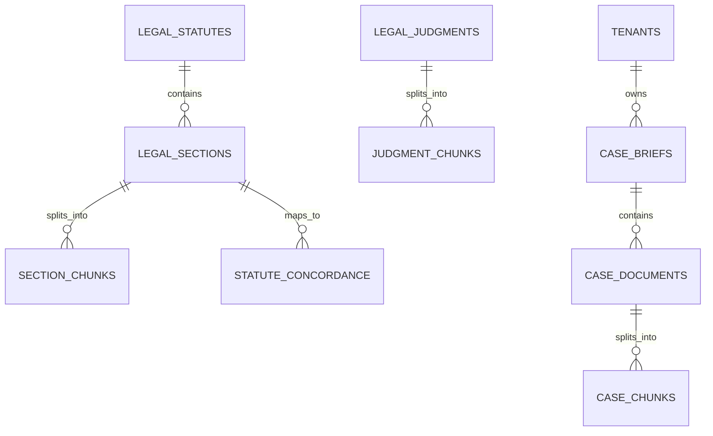

# LegalAI RAG Data Schema: Unified Relational, Vector & Temporal Specification

**Document Version:** 1.0.0  
**Target Platform:** PostgreSQL 16 + `pgvector`  
**Embedding Dimension:** 1024 (`BAAI/bge-large-en-v1.5`)  
**Author:** LegalAI Architecture & Research Team  
**Status:** Approved Technical Standard  

---

## 1. Schema Architecture Overview

The LegalAI RAG data model is designed to support three orthogonal capabilities:
1. **Structural Statutory Indexing:** Pinpoint lookup of exact acts, chapters, sections, sub-sections, explanations, and illustrations.
2. **Temporal & Version Validity:** Precise date-filtering ensuring the system knows exactly which law was in force on any specified incident or filing date.
3. **Multi-Tenant Case Privacy:** Cryptographic and database-level isolation between public legal knowledge and confidential advocate briefs.



---

## 2. PostgreSQL DDL Specification

### A. Extensions & Shared Enum Types

```sql
-- Enable necessary extensions
CREATE EXTENSION IF NOT EXISTS "uuid-ossp";
CREATE EXTENSION IF NOT EXISTS "pgcrypto";
CREATE EXTENSION IF NOT EXISTS "vector";

-- Document classification enum
CREATE TYPE document_type_enum AS ENUM (
    'CONSTITUTIONAL_ARTICLE',
    'CENTRAL_ACT',
    'STATE_ACT',
    'STATUTORY_RULE',
    'REGULATION',
    'GAZETTE_NOTIFICATION',
    'ORDINANCE',
    'APEX_JUDGMENT',
    'HIGH_COURT_JUDGMENT',
    'CASE_FIR',
    'CASE_COMPLAINT',
    'CASE_PETITION',
    'CASE_WRITTEN_STATEMENT',
    'CASE_AFFIDAVIT',
    'CASE_INTERIM_ORDER',
    'CASE_HEARING_NOTE',
    'CASE_DOCUMENT'
);

-- Legal authority weighting enum
CREATE TYPE authority_level_enum AS ENUM (
    'CONSTITUTIONAL',     -- 100: Supreme sovereign law
    'PARLIAMENTARY_ACT',  -- 90: Primary Central legislation
    'APEX_PRECEDENT',     -- 85: Supreme Court of India judgments
    'HIGH_COURT_PRECEDENT', -- 75: High Court precedents
    'SUBORDINATE_RULES',  -- 60: Executive notifications, rules & regulations
    'CASE_EVIDENCE'       -- 50: Private advocate case facts
);

-- Statute status enum
CREATE TYPE statute_status_enum AS ENUM (
    'IN_FORCE',
    'REPEALED',
    'AMENDED',
    'ENACTED_PENDING_COMMENCEMENT'
);
```

---

### B. Public Legal Knowledge Tables (LEGAL RAG)

#### 1. `legal_statutes`
Stores overarching metadata for Central and State Acts, codes, and constitutional charters.

```sql
CREATE TABLE legal_statutes (
    statute_id UUID PRIMARY KEY DEFAULT uuid_generate_v4(),
    act_name VARCHAR(255) NOT NULL,
    short_title VARCHAR(100) NOT NULL,
    act_number INT,
    act_year INT NOT NULL,
    enactment_date DATE,
    commencement_date DATE NOT NULL,
    repeal_date DATE,
    status statute_status_enum NOT NULL DEFAULT 'IN_FORCE',
    jurisdiction VARCHAR(100) NOT NULL DEFAULT 'INDIA_CENTRAL',
    ministry VARCHAR(255),
    source_url TEXT NOT NULL,
    official_gazette_id VARCHAR(100),
    total_sections INT,
    content_hash VARCHAR(64) NOT NULL,
    created_at TIMESTAMPTZ NOT NULL DEFAULT NOW(),
    updated_at TIMESTAMPTZ NOT NULL DEFAULT NOW()
);

CREATE UNIQUE INDEX idx_statute_unique ON legal_statutes(short_title, act_year);
```

#### 2. `legal_sections`
Stores canonical section-by-section text, statutory marginal notes, and sub-clauses.

```sql
CREATE TABLE legal_sections (
    section_id UUID PRIMARY KEY DEFAULT uuid_generate_v4(),
    statute_id UUID NOT NULL REFERENCES legal_statutes(statute_id) ON DELETE CASCADE,
    chapter_number VARCHAR(50),
    chapter_title VARCHAR(255),
    section_number VARCHAR(50) NOT NULL,
    section_title VARCHAR(255) NOT NULL,
    full_text TEXT NOT NULL,
    punishment_summary TEXT,
    bailable_status VARCHAR(50),      -- 'BAILABLE', 'NON_BAILABLE', 'N/A'
    cognizable_status VARCHAR(50),    -- 'COGNIZABLE', 'NON_COGNIZABLE', 'N/A'
    triable_by VARCHAR(100),          -- 'MAGISTRATE_FIRST_CLASS', 'COURT_OF_SESSION', 'N/A'
    effective_from DATE NOT NULL,
    effective_to DATE,
    is_current BOOLEAN NOT NULL DEFAULT TRUE,
    amendment_history JSONB DEFAULT '[]'::jsonb,
    content_hash VARCHAR(64) NOT NULL,
    created_at TIMESTAMPTZ NOT NULL DEFAULT NOW()
);

CREATE INDEX idx_sections_lookup ON legal_sections(statute_id, section_number);
CREATE INDEX idx_sections_effective ON legal_sections(effective_from, effective_to);
```

#### 3. `section_chunks`
Stores dense vectors and lexical representations of statutory provisions for hybrid search.

```sql
CREATE TABLE section_chunks (
    chunk_id UUID PRIMARY KEY DEFAULT uuid_generate_v4(),
    section_id UUID NOT NULL REFERENCES legal_sections(section_id) ON DELETE CASCADE,
    statute_id UUID NOT NULL REFERENCES legal_statutes(statute_id) ON DELETE CASCADE,
    act_name VARCHAR(255) NOT NULL,
    section_number VARCHAR(50) NOT NULL,
    chunk_index INT NOT NULL DEFAULT 0,
    chunk_content TEXT NOT NULL,
    authority_level authority_level_enum NOT NULL DEFAULT 'PARLIAMENTARY_ACT',
    document_type document_type_enum NOT NULL DEFAULT 'CENTRAL_ACT',
    effective_from DATE NOT NULL,
    effective_to DATE,
    is_current BOOLEAN NOT NULL DEFAULT TRUE,
    
    -- Lexical Search Representation
    tsv_content TSVECTOR GENERATED ALWAYS AS (to_tsvector('english', chunk_content)) STORED,
    
    -- Dense Vector Representation (1024-dim BGE-Large)
    embedding vector(1024) NOT NULL,
    
    content_hash VARCHAR(64) NOT NULL,
    created_at TIMESTAMPTZ NOT NULL DEFAULT NOW()
);

-- Vector similarity index using HNSW
CREATE INDEX idx_section_chunks_embedding ON section_chunks 
USING hnsw (embedding vector_cosine_ops) 
WITH (m = 16, ef_construction = 64);

-- Full-text lexical search index
CREATE INDEX idx_section_chunks_tsv ON section_chunks USING gin(tsv_content);
CREATE INDEX idx_section_chunks_filter ON section_chunks(act_name, section_number, is_current);
```

#### 4. `statute_concordance`
Explicit mapping between legacy colonial statutes and modern 2023 criminal codes.

```sql
CREATE TABLE statute_concordance (
    concordance_id UUID PRIMARY KEY DEFAULT uuid_generate_v4(),
    legacy_act VARCHAR(100) NOT NULL,       -- e.g. 'Indian Penal Code, 1860'
    legacy_section VARCHAR(50) NOT NULL,    -- e.g. '420'
    modern_act VARCHAR(100) NOT NULL,       -- e.g. 'Bharatiya Nyaya Sanhita, 2023'
    modern_section VARCHAR(50) NOT NULL,    -- e.g. '318(4)'
    offence_or_subject VARCHAR(255) NOT NULL, -- e.g. 'Cheating and dishonestly inducing delivery of property'
    mapping_type VARCHAR(50) NOT NULL,      -- 'EXACT', 'MODIFIED', 'SPLIT', 'MERGED'
    substantive_changes TEXT,
    created_at TIMESTAMPTZ NOT NULL DEFAULT NOW()
);

CREATE INDEX idx_concordance_legacy ON statute_concordance(legacy_act, legacy_section);
CREATE INDEX idx_concordance_modern ON statute_concordance(modern_act, modern_section);
```

---

### C. Case-Specific Multi-Tenant Tables (CASE-SPECIFIC RAG)

#### 1. `tenants` & `case_briefs`

```sql
CREATE TABLE tenants (
    tenant_id UUID PRIMARY KEY DEFAULT uuid_generate_v4(),
    firm_or_lawyer_name VARCHAR(255) NOT NULL,
    bar_council_id VARCHAR(100),
    is_active BOOLEAN NOT NULL DEFAULT TRUE,
    created_at TIMESTAMPTZ NOT NULL DEFAULT NOW()
);

CREATE TABLE case_briefs (
    case_id UUID PRIMARY KEY DEFAULT uuid_generate_v4(),
    tenant_id UUID NOT NULL REFERENCES tenants(tenant_id) ON DELETE CASCADE,
    case_title VARCHAR(255) NOT NULL,
    internal_ref_number VARCHAR(100),
    court_name VARCHAR(255),
    court_case_number VARCHAR(100),
    client_name VARCHAR(255),
    incident_date DATE,
    filing_date DATE,
    case_status VARCHAR(50) DEFAULT 'ACTIVE',
    created_at TIMESTAMPTZ NOT NULL DEFAULT NOW()
);

CREATE INDEX idx_case_tenant ON case_briefs(tenant_id, case_id);
```

#### 2. `case_chunks` (With Strict Row-Level Security)

```sql
CREATE TABLE case_chunks (
    chunk_id UUID PRIMARY KEY DEFAULT uuid_generate_v4(),
    tenant_id UUID NOT NULL REFERENCES tenants(tenant_id) ON DELETE CASCADE,
    case_id UUID NOT NULL REFERENCES case_briefs(case_id) ON DELETE CASCADE,
    document_title VARCHAR(255) NOT NULL,
    document_type document_type_enum NOT NULL,
    document_date DATE,
    chunk_index INT NOT NULL,
    chunk_content TEXT NOT NULL,
    authority_level authority_level_enum NOT NULL DEFAULT 'CASE_EVIDENCE',
    
    -- Lexical Search
    tsv_content TSVECTOR GENERATED ALWAYS AS (to_tsvector('english', chunk_content)) STORED,
    
    -- Dense Vector
    embedding vector(1024) NOT NULL,
    
    created_at TIMESTAMPTZ NOT NULL DEFAULT NOW()
);

-- Enable Row-Level Security (RLS)
ALTER TABLE case_chunks ENABLE ROW LEVEL SECURITY;

-- Create Tenant Isolation Policy
CREATE POLICY tenant_isolation_policy ON case_chunks
    FOR ALL
    USING (
        tenant_id = NULLIF(current_setting('app.current_tenant_id', true), '')::uuid
        AND
        case_id = NULLIF(current_setting('app.current_case_id', true), '')::uuid
    );

-- Indices for isolated case retrieval
CREATE INDEX idx_case_chunks_tenant_case ON case_chunks(tenant_id, case_id);
CREATE INDEX idx_case_chunks_embedding ON case_chunks USING hnsw (embedding vector_cosine_ops) WITH (m = 16, ef_construction = 64);
CREATE INDEX idx_case_chunks_tsv ON case_chunks USING gin(tsv_content);
```

---

## 3. Comprehensive Metadata Dictionary

Every retrieved passage injected into the context window of Qwen2.5-14B carries the following standardized JSON metadata dictionary:

| Field Name | Type | Description | Example Value |
| :--- | :--- | :--- | :--- |
| `source` | string | Sovereign publication source | `"THE_GAZETTE_OF_INDIA"` |
| `source_url` | string | Authoritative permanent URL | `"https://indiacode.nic.in/handle/123456789/2023_45#sec_103"` |
| `document_type` | string | Legal taxonomy classification | `"CENTRAL_ACT"` |
| `title` | string | Provision heading | `"Punishment for murder"` |
| `act_name` | string | Full statutory title | `"Bharatiya Nyaya Sanhita, 2023"` |
| `short_code` | string | Common advocate acronym | `"BNS_2023"` |
| `section` | string | Section number | `"103"` |
| `subsection` | string | Specific sub-clause | `"1"` |
| `chapter` | string | Roman chapter number | `"Chapter VI"` |
| `effective_from` | ISO Date | Mandatory commencement date | `"2024-07-01"` |
| `effective_to` | ISO Date | Repeal date (or null if current) | `null` |
| `is_current` | boolean | Active status | `true` |
| `replaces_act` | string | Historical statute replaced | `"Indian Penal Code, 1860"` |
| `replaces_section`| string | Historical equivalent section | `"302"` |
| `bailable` | boolean | Procedural bail classification | `false` |
| `cognizable` | boolean | Police arrest without warrant | `true` |
| `authority_level`| string | Hierarchical legal weighting | `"PARLIAMENTARY_ACT"` |
| `content_hash` | string | SHA-256 integrity digest | `"a4f91e3b890c..."` |
| `tenant_id` | UUID | Multi-tenant privacy tag (case data) | `"3fa85f64-5717-4562-b3fc-2c963f66afa6"` |

---

## 4. Prompt Context Injection Payload Schema

When relevant context is retrieved, it is structured into a clean JSON markdown block for the LLM:

```json
{
  "retrieved_context": [
    {
      "citation_id": 1,
      "act": "Bharatiya Sakshya Adhiniyam, 2023",
      "section": "63(4)",
      "heading": "Admissibility of electronic records",
      "effective_from": "2024-07-01",
      "status": "CURRENT_LAW",
      "concordance_legacy_section": "Section 65B(4), Indian Evidence Act, 1872",
      "text": "In any proceedings where it is desired to give a statement in evidence by virtue of this section, a certificate doing any of the following things, that is to say, identifying the electronic record containing the statement and describing the manner in which it was produced...",
      "official_source": "https://indiacode.nic.in/handle/123456789/2023_47#sec_63"
    }
  ],
  "verification_guardrails": {
    "target_incident_date": "2024-08-15",
    "applicable_criminal_code": "BHARATIYA_NYAYA_SANHITA_2023",
    "applicable_procedural_code": "BHARATIYA_NAGARIK_SURAKSHA_SANHITA_2023",
    "applicable_evidence_code": "BHARATIYA_SAKSHYA_ADHINIYAM_2023",
    "verified_non_existent_sections": ["Section 505A BNS", "Section 302B BNS"]
  }
}
```
