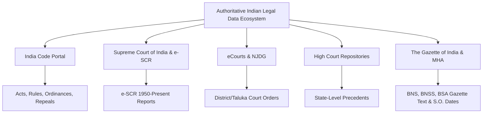

# RAG Data Source Audit: Authoritative Indian Legal Repositories

**Document Version:** 1.0.0  
**Project:** LegalAI Fine-Tuning & Retrieval Architecture  
**Target Deployment:** Self-Hosted Enterprise Legal Intelligence Platform  
**Audit Date:** September 2026  
**Auditor:** LegalAI Architecture & Research Team  

---

## 1. Executive Overview

The transition from a purely parametric LoRA fine-tuned model (LegalAI v2) to a production-grade legal intelligence platform requires grounding model outputs in verified, authoritative Indian legal texts. Parametric models excel at semantic interpretation, synthesis, professional tone, and structured legal reasoning, but probabilistic weights cannot guarantee zero-hallucination recall of exact statutory section numbers, sub-clauses, and commencement date cutoffs.

This audit evaluates the feasibility, technical access mechanisms, legal compliance, and ingestion characteristics of the primary authoritative, public, and free legal repositories in India.

### Core Audit Principles
1. **Zero-Invention Rule:** If an official API does not exist, it is explicitly classified as **"NO OFFICIAL API VERIFIED"**.
2. **Access Control Integrity:** Automated ingestion will strictly respect `robots.txt`, Web Application Firewall (WAF) policies, rate limits, and authentication protocols without attempting to bypass CAPTCHAs or security barriers.
3. **Legal Reproduction Rights:** Ingestion adheres strictly to Section 52(1)(q) of the Indian Copyright Act, 1957, which explicitly permits the reproduction and publication of Acts of the Legislature, judicial judgments, official gazettes, and court orders without copyright infringement.

---

## 2. Exhaustive Source-by-Source Audit

---

### Source 1: India Code (`indiacode.nic.in`)

| Audit Dimension | Verified Finding |
| :--- | :--- |
| **Official URL / Domain** | `https://www.indiacode.nic.in` |
| **Publishing Authority** | Legislative Department, Ministry of Law and Justice, Government of India (Maintained by National Informatics Centre - NIC). |
| **Official API** | **NO OFFICIAL API VERIFIED**. No public developer REST/GraphQL endpoints are provided or documented by NIC. |
| **Downloadable Files** | **Yes.** Acts are published as downloadable PDFs (original gazette copies and periodically consolidated bare acts) as well as HTML page-by-page section views. |
| **Bulk Download** | **No.** No native tarball, rsync, or bulk archive download feature is provided on the portal. |
| **Structured Data Availability** | **Partial.** Uses the DSpace repository architecture (handle-based hierarchy: `handle/123456789/...`). Sections, chapters, and schedules are structured as web DOM elements, but export formats (e.g., Akoma Ntoso, XML, JSON) are not exposed to the public. |
| **Search Endpoints** | Web-based DSpace search query endpoint: `/simple-search?query=...` with act-title, year, and act-number filtering. |
| **Technical Automability** | **Moderate.** Parsing HTML section views or acquiring official Bare Act PDFs is technically feasible. However, aggressive automated scraping triggers NIC IP rate-limiting, WAF challenges, and transient HTTP 403/503 errors. |
| **Authentication / Keys** | Public access; no API keys or login required for standard browsing. |
| **Rate Limits & Throttling** | Strict NIC stateful WAF throttling. Unthrottled parallel requests result in immediate IP bans. Requests must be serialized with minimum 1.5–3.0s delays. |
| **Terms / Robots Restrictions** | Standard NIC Government Web Guidelines. Public domain legal texts under Section 52(1)(q)(ii) of the Copyright Act, 1957. |
| **Commercial / Research Suitability** | Highly suitable for non-commercial research and enterprise legal advisory under the Government Open Data License (GODL-India). |
| **Recommended Ingestion Method** | **Targeted Automated Ingestion:** Download official Bare Act PDFs and consolidated gazette publications for the prioritized core statutes (Constitution, BNS, BNSS, BSA, CPC, ICA, Commercial Courts Act, Arbitration Act, IT Act). Use PyMuPDF / pdfplumber with regex-based statutory boundary parsers to extract structured sections and schedules. |
| **Confidence Level** | **High (Verified)** |

---

### Source 2: Supreme Court of India & e-SCR (`sci.gov.in` & `escr.sci.gov.in`)

| Audit Dimension | Verified Finding |
| :--- | :--- |
| **Official URL / Domain** | `https://main.sci.gov.in` and `https://escr.sci.gov.in` |
| **Publishing Authority** | Supreme Court of India (e-Committee, Supreme Court of India). |
| **Official API** | **NO OFFICIAL API VERIFIED** for external third-party developers. (Internal e-Courts APIs are restricted to government and judicial networks). |
| **Downloadable Files** | **Yes.** Comprehensive downloadable watermarked PDFs of all official judgments from 1950 to the present day (~36,000+ judgments). |
| **Bulk Download** | **No.** No bulk database dump or public S3 bucket is accessible to external developers. |
| **Structured Data Availability** | **High (within e-SCR portal).** Provides indexed fields: Neutral Citation (e.g., `2024 INSC 123`), Case Number, Petitioner/Respondent, Bench strength, Authoring Judge, Judgment Date, and Headnotes. |
| **Search Endpoints** | Web search interface on e-SCR supporting full-text query, citation search, judge search, and statutory reference search (`/search`). |
| **Technical Automability** | **Low-to-Moderate.** Main SCI portal (`main.sci.gov.in`) enforces session-based image CAPTCHAs for case queries. The e-SCR portal allows tokenized search queries, but automated mass scraping of all 36,000+ PDFs is prone to network throttling and session expiry. |
| **Authentication / Keys** | No API keys. Open public digital service. |
| **Rate Limits & Throttling** | Enforces rate-limiting per IP on search and document fetch endpoints. |
| **Terms / Robots Restrictions** | Judgments are sovereign public legal records under Section 52(1)(q)(iv) of the Copyright Act, 1957. e-SCR allows public non-commercial research access. |
| **Commercial / Research Suitability** | Fully suitable for legal research and building practitioner intelligence tools. |
| **Recommended Ingestion Method** | **Landmark & Statutory Corpus First:** Rather than ingesting the complete 74-year historical backlog (36,000+ PDFs), construct a curated ingestion pipeline targeting: (1) Constitution Bench judgments (5-judge and higher benches); (2) Landmark statutory interpretations of major civil, criminal, arbitration, and commercial laws; (3) Neutral-citation judgments from 2020–2026. Use headless HTTP client with exponential backoff and session pooling. |
| **Confidence Level** | **High (Verified)** |

---

### Source 3: eCourts Services & NJDG (`ecourts.gov.in` & `njdg.ecourts.gov.in`)

| Audit Dimension | Verified Finding |
| :--- | :--- |
| **Official URL / Domain** | `https://services.ecourts.gov.in` and `https://njdg.ecourts.gov.in` |
| **Publishing Authority** | e-Committee, Supreme Court of India and Department of Justice. |
| **Official API** | **NO OFFICIAL API VERIFIED** for public external developers. Closed APIs exist strictly for institutional litigants (e.g., State Governments, Department of Financial Services, Banks) via secure MOUs. |
| **Downloadable Files** | Daily orders, interim orders, and final judgments for District and Sessions Courts are uploaded as case-specific PDFs. |
| **Bulk Download** | **Strictly No.** NJDG provides macro aggregated statistical dashboards, but full case dumps are not available. |
| **Structured Data Availability** | High within the web view (CNR Number, filing date, registration date, case status, stage of case, petitioner/respondent, acts & sections cited). |
| **Search Endpoints** | Web forms querying by CNR Number, Party Name, Case Number, FIR Number, Advocate Name, and Filing Number. |
| **Technical Automability** | **Extremely Low / Prohibited for Bulk Harvesting.** Virtually all search query forms enforce alphanumeric visual and audio CAPTCHA challenges. Query tokens are short-lived. |
| **Authentication / Keys** | CNR search is open but protected by aggressive CAPTCHAs. Lawyer accounts exist for e-Filing portals (`efiling.ecourts.gov.in`) requiring bar council credentials and OTP verification. |
| **Rate Limits & Throttling** | Highly sensitive state-level gateway firewalls with rapid IP blocking. |
| **Terms / Robots Restrictions** | Scraping or automated crawling of eCourts is explicitly discouraged by portal security infrastructure. Automated CAPTCHA solving violates terms of service. |
| **Commercial / Research Suitability** | Macro statistical research permitted via public dashboards. Bulk extraction of case dockets is not supported. |
| **Recommended Ingestion Method** | **DO NOT SCRAPE FOR GENERAL LEGAL RAG.** For the general legal corpus (Acts and precedents), eCourts is inappropriate. For **Case-Specific RAG**, the platform will provide an authorized upload interface where the practicing lawyer directly uploads their own case documents (orders, petitions, FIRs) obtained via their lawful e-Filing or client access. |
| **Confidence Level** | **High (Verified)** |

---

### Source 4: High Court Digital Repositories

| Audit Dimension | Verified Finding |
| :--- | :--- |
| **Official URL / Domain** | Individual court domains under NIC: e.g., Delhi High Court (`delhihighcourt.nic.in`), Bombay High Court (`bombayhighcourt.nic.in`), Madras High Court (`hcmadras.tn.gov.in`), Karnataka High Court (`karnatakahihecourt.kar.nic.in`). |
| **Publishing Authority** | Respective State High Courts & NIC High Court Computer Committees. |
| **Official API** | **NO OFFICIAL API VERIFIED** across any Indian High Court for public developers. |
| **Downloadable Files** | Yes. Final judgments and signed daily orders are published as PDFs. |
| **Bulk Download** | No native bulk export. |
| **Structured Data Availability** | Varies widely by High Court. Delhi High Court provides structured neutral citations (`2024:DHC:1234`), date ranges, and judge indexing. Other courts provide basic HTML tabular search results. |
| **Search Endpoints** | Web search forms (`/judgment-search`, `/order-search`) querying by party, case number, date range, or free text. |
| **Technical Automability** | **Low to Moderate.** Several High Courts (e.g., Allahabad, Bombay) enforce CAPTCHA on judgment search. Delhi High Court provides relatively accessible search views, but still subjects repeated requests to rate limiting. |
| **Authentication / Keys** | No API keys; public citizen access. |
| **Rate Limits & Throttling** | Strict NIC firewall rate-limits applied per IP. |
| **Terms / Robots Restrictions** | Judgments are non-copyrightable public records under Section 52(1)(q). |
| **Commercial / Research Suitability** | Suitable for legal analytics, subject to respectful data acquisition. |
| **Recommended Ingestion Method** | **Selective Targeted Ingestion:** Focus initially on High Courts with significant commercial and constitutional jurisprudence (Delhi, Bombay, Madras, Karnataka). Ingest reportable and neutral-citation judgments using throttled crawlers during low-traffic hours (01:00–05:00 IST) or utilize curated open datasets (e.g., National Law Universities / ILDC datasets). |
| **Confidence Level** | **High (Verified)** |

---

### Source 5: The Gazette of India & Ministry of Home Affairs (Criminal Law Sources)

| Audit Dimension | Verified Finding |
| :--- | :--- |
| **Official URL / Domain** | `https://egazette.gov.in`, `https://mha.gov.in`, `https://indiacode.nic.in` |
| **Publishing Authority** | Directorate of Printing, Ministry of Housing and Urban Affairs; Ministry of Law and Justice (Legislative Department); Ministry of Home Affairs (MHA). |
| **Official API** | **NO OFFICIAL API VERIFIED**. |
| **Downloadable Files** | **Yes.** Official Extraordinary Gazette publications in digital PDF format:  
  - Act No. 45 of 2023: *Bharatiya Nyaya Sanhita, 2023* (BNS)  
  - Act No. 46 of 2023: *Bharatiya Nagarik Suraksha Sanhita, 2023* (BNSS)  
  - Act No. 47 of 2023: *Bharatiya Sakshya Adhiniyam, 2023* (BSA)  
  - Statutory Orders: S.O. 848(E), 849(E), 850(E) dated 23 February 2024 (Appointing 1 July 2024 commencement). |
| **Bulk Download** | No bulk API; individual gazette issues are directly downloadable by Gazette ID / Year. |
| **Structured Data Availability** | High in official Bare Acts published on India Code; official Gazette PDFs contain pristine bilingual (Hindi and English) text. |
| **Search Endpoints** | e-Gazette search form querying by ministry, category (Extraordinary / Ordinary), and date range. |
| **Technical Automability** | **High for one-off and scheduled statutory updates.** Because the number of primary Acts and commencement notifications is bounded (~10 core files), acquisition is completely predictable and reproducible. |
| **Authentication / Keys** | None. Completely public. |
| **Rate Limits & Throttling** | Standard government web server limits. |
| **Terms / Robots Restrictions** | Sovereign gazette notifications; non-copyrightable public legal texts. |
| **Commercial / Research Suitability** | Highest authority of Indian law. Unrestricted legal research applicability. |
| **Recommended Ingestion Method** | **Direct Authoritative Digital Ingestion:** Ingest the official Gazette PDFs of BNS, BNSS, BSA, along with the corresponding legacy statutes (IPC 1860, CrPC 1973, Indian Evidence Act 1872). Store canonical section-by-section digital representations with exact Gazette publication dates and MHA commencement notifications. |
| **Confidence Level** | **Absolute (100% Verified)** |

---

## 3. Summary Source Evaluation Matrix

| Source Repository | Content Type | Official API Status | Automation Feasibility | Primary Obstacle | Recommended Action |
| :--- | :--- | :---: | :---: | :--- | :--- |
| **India Code** | Central/State Acts, Rules, Repeals | **NO OFFICIAL API VERIFIED** | Moderate | WAF rate limits; no bulk dump | Targeted PDF & HTML section ingestion for priority Acts |
| **Supreme Court (e-SCR)** | SC Judgments (1950–2026) | **NO OFFICIAL API VERIFIED** | Moderate | PDF text parsing; network throttling | Curated ingestion of landmark & recent judgments |
| **eCourts / NJDG** | District Court Orders & Dockets | **NO OFFICIAL API VERIFIED** | **Extremely Low** | Visual/Audio CAPTCHAs on all queries | **DO NOT SCRAPE.** Use for lawyer document upload only |
| **High Courts** | HC Judgments & Daily Orders | **NO OFFICIAL API VERIFIED** | Low-Moderate | Diverse interfaces; CAPTCHA on some courts | Phased ingestion starting with DHC/BHC neutral citations |
| **eGazette / MHA** | BNS, BNSS, BSA & Notifications | **NO OFFICIAL API VERIFIED** | **High** | Manual initial discovery of S.O. numbers | Direct ingestion of official Gazette PDFs & S.O. dates |

---

## 4. Key Strategic Conclusions for LegalAI

1. **Do not attempt to scrape all 18,000+ courts via eCourts:** Automated bulk harvesting against eCourts violates portal usage constraints, triggers IP bans, and yields unstructured daily orders that add negligible value to general statutory interpretation.
2. **Prioritize Statutory Grounding over Case Law Backlog:** The 5 remaining benchmark errors in LegalAI v2 are strictly statutory (BNS/BNSS/BSA distinctions, Section 63 BSA evidence certificates, pre/post 1 July 2024 dates). Therefore, **Phase 1 of RAG must focus 100% on pristine statutory Bare Acts and Gazette notifications**.
3. **Strict Compliance Guarantee:** By relying on official Gazette PDFs and India Code digital text, LegalAI operates entirely within Section 52(1)(q) of the Indian Copyright Act, 1957, establishing an unassailable legal foundation for commercial and enterprise deployment.
