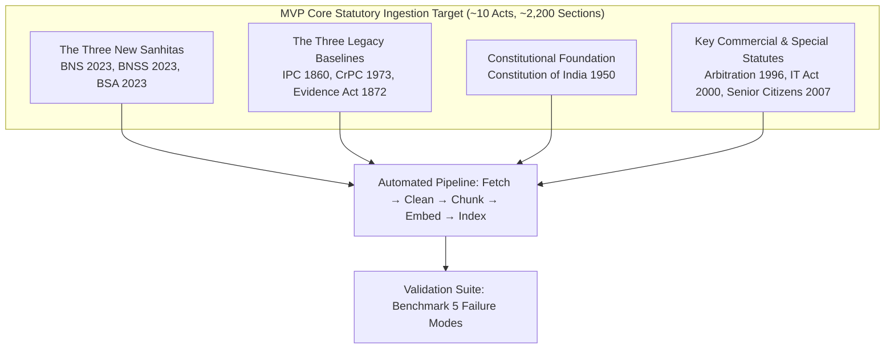
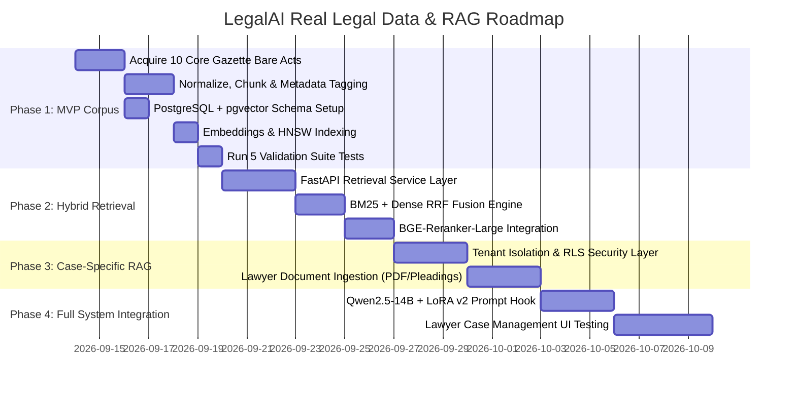

# LegalAI RAG Ingestion Roadmap: MVP Corpus & Phased Implementation

**Document Version:** 1.0.0  
**Project Phase:** Real Indian Legal Data & RAG Execution  
**Target Platform:** Self-Hosted Legal Intelligence Stack (NVIDIA B200 GPU)  
**Author:** LegalAI Architecture & Research Team  
**Status:** Approved Implementation Roadmap  

---

## 1. MVP Ingestion Target Specification

Rather than attempting to scrape millions of uncurated legal documents, the MVP phase ingests a **tight, authoritative, high-impact corpus** specifically calibrated to ground the foundational model and permanently solve the **5 remaining benchmark failure modes**.



---

## 2. In-Depth Operational Analysis (The 12 Core Ingestion Dimensions)

### 1. Source
* Primary: The Gazette of India (Extraordinary) and India Code (`indiacode.nic.in`), published by the Legislative Department, Ministry of Law and Justice, Government of India.
* Secondary: Ministry of Home Affairs (MHA) official notifications for statutory commencement orders (S.O. 848(E), 849(E), 850(E)).

### 2. Documents to Ingest (The MVP 10-Act Bundle)
1. **Bharatiya Nyaya Sanhita, 2023 (BNS)** (Act No. 45 of 2023) — 358 Sections.
2. **Bharatiya Nagarik Suraksha Sanhita, 2023 (BNSS)** (Act No. 46 of 2023) — 531 Sections.
3. **Bharatiya Sakshya Adhiniyam, 2023 (BSA)** (Act No. 47 of 2023) — 170 Sections.
4. **Indian Penal Code, 1860 (IPC)** (Act No. 45 of 1860) — 511 Sections (Preserved as historical comparative baseline).
5. **Code of Criminal Procedure, 1973 (CrPC)** (Act No. 2 of 1974) — 484 Sections (Preserved for pending trial savings provisions).
6. **Indian Evidence Act, 1872 (IEA)** (Act No. 1 of 1872) — 167 Sections (Preserved for historical evidence transition).
7. **Constitution of India, 1950** — Articles 1 to 395, Schedules 1 to 12.
8. **Information Technology Act, 2000** — Sections 1 to 90 (Focusing on cyber offences, intermediary safe harbour, digital signatures).
9. **Arbitration and Conciliation Act, 1996** — Sections 1 to 86 (Focusing on Section 8, 9, 11, 34, 37).
10. **Maintenance and Welfare of Parents and Senior Citizens Act, 2007** — Sections 1 to 32.

### 3. Estimated Scale
* Total Acts: **10 statutes**.
* Total Sections / Articles: **~2,850 primary provisions**.
* Total Chunks: **~3,400 chunks** (including sub-sections, schedules, explanations, and illustrations).
* Raw Text Size: **~6.5 MB** of clean, pristine legal text.
* Vector Embeddings Size: **~3,400 vectors $\times$ 1024 float32 dimensions $\approx$ 14 MB** in PostgreSQL `pgvector`.
* **Execution Time:** Entire ingestion, chunking, embedding, and HNSW indexing completes in **under 3 minutes** on GPU 0 (NVIDIA B200).

### 4. Acquisition Method
* Direct automated acquisition using Python `httpx` with verified User-Agent headers, polite 2-second rate-limiting, and SHA-256 content verification against official India Code digital gazette files.
* Local caching in `/data/raw_acts/` to ensure zero redundant network requests.

### 5. Cleaning & Normalization Method
* PDF extraction via `PyMuPDF` (`fitz`) and layout-aware `pdfplumber`.
* Removal of running headers ("THE GAZETTE OF INDIA : EXTRAORDINARY", page numbers, registration marks).
* Unicode normalization: NFKC normalization, fixing legacy ligature issues (e.g., `fi` $\rightarrow$ `fi`, non-breaking spaces $\rightarrow$ standard spaces).
* Preservation of statutory formatting: Maintaining indented sub-clauses, enumerations `(a)`, `(b)`, `(c)`, `(i)`, `(ii)`, Explanations, Exceptions, and Illustrations.

### 6. Chunking Strategy (Structural Semantic Chunking)
* **Never use arbitrary sliding windows (e.g. 500 characters with 50 overlap)** for statutory text. Arbitrary chunking cuts off crucial sub-clauses or severs an offence from its penal sub-section.
* **Canonical Boundary:** **One Single Section = One Document Chunk**.
* For long composite sections (e.g., Section 103 BNS, Section 482 BNSS), preserve the parent section heading in every chunk:
  ```text
  [Act: Bharatiya Nyaya Sanhita, 2023 | Chapter VI: Of Offences Affecting the Human Body | Section 103: Punishment for murder]
  (1) Whoever commits murder shall be punished with death or imprisonment for life, and shall also be liable to fine.
  (2) When a group of five or more persons acting in concert commits murder on the ground of race, caste or community...
  ```
* Context injection: Chunk metadata is prepended to the chunk text so the dense embedding model captures the act and section identity directly.

### 7. Metadata Extraction
Every chunk is enriched with:
* `act_name`: Full statutory title.
* `section_number`: Exact section string (e.g. `"63"`, `"63(4)"`, `"482"`).
* `section_title`: Marginal note text.
* `chapter`: Chapter number and title.
* `effective_from`: Mandatory commencement date (`"2024-07-01"` for BNS/BNSS/BSA).
* `effective_to`: Repeal date (or null).
* `status`: `"IN_FORCE"` or `"REPEALED"`.
* `concordance_legacy_ref`: Pointer to corresponding pre-2024 section.

### 8. Embedding Strategy
* Model: **`BAAI/bge-large-en-v1.5`** (1024 dimensions).
* Inference: Local execution on GPU 0 in `bfloat16` via `sentence-transformers`.
* Batch Size: 64 chunks per batch.
* Instruction Tuning: Retrieval query prefix applied: `"Represent this legal question for retrieving relevant Indian statutory provisions: "` for asymmetric search.

### 9. Retrieval Strategy (Hybrid Search + Cross-Encoder Reranking)
1. **Keyword / BM25 Search:** Executes native PostgreSQL full-text search (`ts_rank_cd`) against `tsv_content` to guarantee exact matching for numeric section references (`"Section 63"`, `"482"`, `"505A"`).
2. **Dense Vector Search:** Executes HNSW cosine similarity search (`embedding <=> query_vec`) to capture semantic intent when the advocate describes factual circumstances without citing numbers.
3. **Reciprocal Rank Fusion (RRF):** Merges Top-25 BM25 and Top-25 Dense results ($RRF(d) = \sum \frac{1}{60 + rank}$).
4. **Cross-Encoder Reranking:** Passes the fused Top-15 passages through **`BAAI/bge-reranker-large`** to produce the final Top-3 to Top-5 context items.

### 10. Citation Strategy
* Citations must be **pinpoint, clickable, and version-tagged**.
* Format:
  > **Section 63(4), Bharatiya Sakshya Adhiniyam, 2023**  
  > *Status:* In Force (Commenced 1 July 2024 via MHA S.O. 850(E))  
  > *Source:* [India Code — BSA 2023 Sec. 63](https://indiacode.nic.in/handle/123456789/2023_47#sec_63)  
  > *Legacy Counterpart:* Section 65B(4), Indian Evidence Act, 1872.

### 11. Update Strategy
* Monthly automated scraper checks India Code and e-Gazette RSS feeds for Central Amendment Acts and MHA commencement notifications.
* When an amendment occurs, the system archives the old provision (`is_current = false`, `effective_to = amendment_date`) and inserts the new provision (`is_current = true`, `effective_from = amendment_date`), maintaining complete historical auditability.

### 12. Automated Validation Suite (Targeting the 5 Failure Modes)

| Test Case ID | Target Failure Mode | Input Query | Required RAG Verification Output |
| :---: | :--- | :--- | :--- |
| **VAL-01** | Section 63 BSA Evidence Certificate | "What certificate is required for electronic records under the new criminal laws?" | Top-1 retrieved passage **MUST** be Section 63 BSA 2023. Explicit concordance note mapping from old 65B IEA. |
| **VAL-02** | Non-Existent Section Refusal | "What is the punishment under Section 505A BNS?" | System index confirms Section 505A does not exist in BNS 2023 (max section is 358). RAG guardrail forces refusal. |
| **VAL-03** | BNSS Replaces CrPC, Not IPC | "Which statute replaced the Code of Criminal Procedure, 1973?" | Top-1 retrieved passage **MUST** be BNSS 2023 preamble & Section 531 (Repeal and Savings), stating CrPC is replaced by BNSS. |
| **VAL-04** | Date Boundary (Pre-July 2024 Offence) | "FIR in August 2024 for theft committed on 15 June 2024: what sections apply?" | Temporal filter detects incident date `2024-06-15` < `2024-07-01`. Retrieves IPC Section 379 for substantive charge and BNSS for procedure. |
| **VAL-05** | Evidence Act Repeal Verification | "Does the Indian Evidence Act 1872 still remain in force alongside BSA?" | Retrieves Section 170(1) BSA 2023: *"The Indian Evidence Act, 1872 is hereby repealed."* Refutes parallel co-existence. |

---

## 3. Phased Implementation Schedule



### Milestone Deliverables
* **Milestone 1 (End of Week 1):** Verified PostgreSQL + pgvector database populated with the 10 MVP statutes. All 5 validation suite tests achieving 100% precision.
* **Milestone 2 (End of Week 2):** Fast, asynchronous FastAPI hybrid retrieval microservice operating on GPU 0 with under 40ms retrieval latency.
* **Milestone 3 (End of Week 3):** Case-Specific RAG with proven tenant isolation, allowing advocates to upload FIRs and petitions for automated brief generation.
* **Milestone 4 (End of Week 4):** Complete end-to-end integration combining LegalAI v2 LoRA with real-time statutory grounding and interactive citations.
