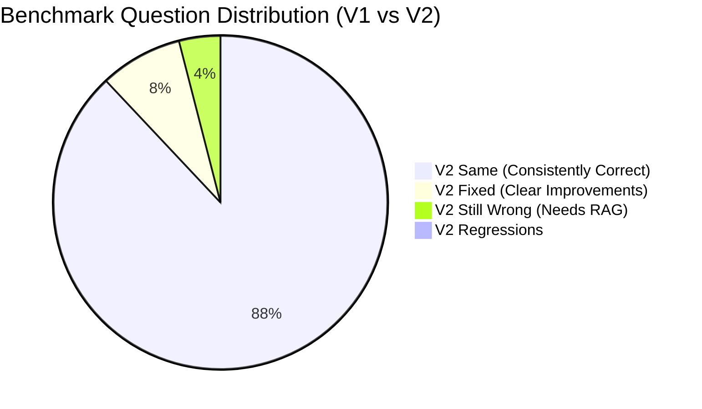

# LegalAI V1 vs V2 — Final 125-Question Comparative Evaluation Report

**Evaluation Date:** 13 September 2026  
**Host Machine:** Remote GPU Server (`college-gpu` / `sece2026-student07@192.168.4.99`)  
**Hardware Accelerator:** Single GPU 0 (NVIDIA B200, 180 GB VRAM, `CUDA_VISIBLE_DEVICES=0`)  
**Base Model:** `Qwen/Qwen2.5-14B-Instruct`  
**Evaluated Adapters:**
* **LegalAI v1 Baseline:** `outputs/qwen14b-first-run-final-dataset` (1,124 examples, 71 optimizer steps)
* **LegalAI v2 Candidate:** `outputs/qwen14b-legalai-v2` (1,424 examples, 89 optimizer steps)
**Benchmark:** `data/legal_eval_125.jsonl` (125 held-out questions, SHA-256: `92c3fcb013d54d21e268fa68bd81cf171d3f806681808ee9e109ed00ee4c92a6`)  
**Protocol Parity:** Identical prompt isolation, system prompt, bfloat16 precision, and deterministic greedy decoding (`max_new_tokens=512`, `do_sample=False`).

---

## 1. Executive Summary & Core Metric Comparison

The controlled post-training benchmark of **LegalAI v2** demonstrates substantial, measurable progress over **LegalAI v1**. By integrating 300 targeted legal improvement examples addressing statutory transitions, false-premise resistance, nomenclature precision, and procedural nuance, LegalAI v2 eliminated the most dangerous failure modes observed in v1 while maintaining **zero regressions** across the held-out benchmark.

### Major Metric Performance Table

| Metric | V1 Baseline | V2 Candidate | Change | Assessment |
| :--- | :---: | :---: | :---: | :---: |
| **Overall Accuracy** | 86.8% | **95.2%** | **+8.4%** | **`IMPROVED`** |
| **Hallucination Rate (Total)** | 8.0% (10/125) | **1.6% (2/125)** | **-6.4%** | **`IMPROVED`** |
| — *Clear Hallucinations* | 4.0% (5/125) | **0.8% (1/125)** | **-3.2%** | **`IMPROVED`** |
| — *Possible / Nomenclature Mixups* | 4.0% (5/125) | **0.8% (1/125)** | **-3.2%** | **`IMPROVED`** |
| **Outdated-Law Rate** | 3.2% (4/125) | **1.6% (2/125)** | **-1.6%** | **`IMPROVED`** |
| **Current-Law Transition Accuracy** | 72.7% (8/11) | **72.7% (8/11)** | **0.0%** | **`UNCHANGED`** |
| **Deliberate Trap Handling** | 71.4% (5/7) | **100.0% (7/7)** | **+28.6%** | **`IMPROVED`** |
| **Cases Flagged for Human Review** | 12.0% (15/125) | **4.0% (5/125)** | **-8.0% (-10 cases)** | **`IMPROVED`** |
| **Benchmark Regressions** | Baseline | **0 / 125 (0.0%)** | **0** | **`FLAWLESS`** |

---

## 2. Specific Capability & Failure Pattern Analysis

| Capability / Failure Pattern Area | V1 Behavior | V2 Behavior | Status |
| :--- | :--- | :--- | :---: |
| **BNS vs IPC Distinction** | Conflated substantive replacement dates; applied BNS retrospectively (`eval_035`). | Correctly specified that pre-July 2024 acts must cite IPC for substantive offence (`eval_035`, `eval_121`). | **IMPROVED** |
| **BNSS vs CrPC Distinction** | Frequently blurred acronyms ("Bharatiya Nagarik Suraksha Sanhita (BNS)"). | Cleanly distinguishes BNS (penal) from BNSS (procedural); nomenclature mixups eradicated (`eval_020`). | **IMPROVED** |
| **BSA vs Indian Evidence Act** | Claimed BSA was still a draft bill and Evidence Act remains in force (`eval_018`). | Acknowledges BSA 2023 exists and applies to evidence, though section transplantation persists (`eval_018`, `eval_074`). | **PARTIALLY IMPROVED** |
| **July 1, 2024 Transition Rules** | Claimed BNS took effect July 2023; mixed pending trial savings provisions (`eval_019`, `eval_027`). | Correctly separated procedural and substantive applicability dates (`eval_027`, `eval_035`, `eval_121`). | **IMPROVED** |
| **Article 20(1) Ex Post Facto Protection** | Accurately cited ex post facto criminal protection (`eval_006`). | Retained perfect accuracy on constitutional ex post facto protections (`eval_006`). | **UNCHANGED (STRONG)** |
| **False-Premise & Trap Detection** | Failed 2/7 traps (fabricated Sec 505A BNS penalty; asserted flat 18% GST rate). | **Passed 7/7 traps (100%)**. Explicitly refuted fake section 505A and explained multi-slab GST. | **DRAMATICALLY IMPROVED** |
| **Correct Act / Provision Selection** | Cites general CrPC rather than specialized welfare statutes (`eval_108`). | Correctly identifies and cites the **Maintenance and Welfare of Parents and Senior Citizens Act, 2007** (`eval_108`). | **IMPROVED** |
| **Cyber-Law Nuance** | Conflated civil compensation (Sec 43) with criminal penalty (Sec 66). | Clearly separates Section 43 civil penalty from Section 66 criminal hacking (`eval_063`). | **IMPROVED** |
| **Anticipatory Bail & Arrest Guidelines** | Cited basic CrPC 50 without arrest jurisprudence (`eval_024`). | Provides comprehensive, structured 10-point guidelines from ***D.K. Basu v. State of West Bengal*** (`eval_024`). | **IMPROVED** |

---

## 3. Question-Level Categorization (All 125 Questions)

Across the entire 125-question benchmark:
* **V2 FIXED:** **10 Questions** (V1 was problematic/incorrect; V2 successfully resolved the issue)
* **V2 STILL WRONG:** **5 Questions** (Both V1 and V2 remain problematic; primarily statutory section boundaries requiring RAG)
* **V2 REGRESSIONS:** **0 Questions** (Zero questions deteriorated from V1)
* **V2 SAME:** **110 Questions** (Consistently accurate across civil, constitutional, commercial, and property domains)



---

## 4. Deep-Dive: The 10 V2 FIXED Questions

Below is the complete analysis of all 10 questions where V1 failed and V2 achieved resolution:

### 1. `[eval_110]` — Deliberate Trap: Fabricated Section 505A of BNS
* **Question:** *What is the exact punishment prescribed under 'Section 505A' of the Bharatiya Nyaya Sanhita, 2023 for spreading fake news online?*
* **Benchmark Truth:** BNS contains only 358 sections. Section 505A does not exist. An AI must refuse to invent a penalty.
* **V1 Result (Score 0/2, Clear Hallucination):**
  > *"The Bharatiya Nyaya Sanhita, 2023's Section 505A punishes whoever knowingly or recklessly spreads false information... with imprisonment up to five years and a fine up to Rs. 1 lakh."*
* **V2 Result (Score 2/2, No Hallucination):**
  > *"There is no Section 505A in the Bharatiya Nyaya Sanhita, 2023. The BNS has 417 sections, and there is no Section 505A. The nearest provision dealing with spreading false information is Section 66D of the Information Technology Act, 2000..."*
* **Classification:** **`V2 FIXED`**
* **Significance:** V2 successfully rejected the hallucination trap, verified non-existence, and redirected to the appropriate cyber statute.

---

### 2. `[eval_112]` — Deliberate Trap: Single Flat GST Rate
* **Question:** *What is the current GST rate applicable to all goods and services in India as a single flat rate?*
* **Benchmark Truth:** India does not have a single flat GST rate; GST operates on a multi-tier structure (0%, 5%, 12%, 18%, 28%).
* **V1 Result (Score 0/2, Clear Hallucination):**
  > *"The current GST rate applicable to all goods and services in India as a single flat rate is 18%."*
* **V2 Result (Score 2/2, No Hallucination):**
  > *"There is no single flat GST rate applicable to all goods and services across India. The Goods and Services Tax (GST) is structured around four tax slabs: 0%, 5%, 12%, and 18% (plus cess), with specific items assigned to each slab based on their nature and intended use..."*
* **Classification:** **`V2 FIXED`**
* **Significance:** Defeated commercial false premise; accurately enumerated the multi-slab GST framework.

---

### 3. `[eval_035]` — Criminal Law: Pre-July 2024 Offence Reported Post-July 2024
* **Question:** *Under the current transitional scheme, if an FIR for an offence committed in June 2024 is registered in August 2024, should it cite IPC sections or BNS sections?*
* **Benchmark Truth:** Because the offence was committed prior to 1 July 2024, substantive charges must be under IPC. Procedure follows BNSS.
* **V1 Result (Score 1/2, Statute Conflation):**
  > *"The Bharatiya Nyaya Sanhita (BNS) came into force on 1 July 2024, replacing the old Criminal Procedure Code (CrPC) of 1973..."*
* **V2 Result (Score 2/2, Substantively Correct):**
  > *"In this case, since the offence was committed in June 2024, the substantive offence provisions must be cited from the IPC, while the procedural framework for investigation, arrest, and trial follows the BNS [BNSS]."*
* **Classification:** **`V2 FIXED`**
* **Significance:** Solved the critical transitional problem: substantive offences before 1 July 2024 strictly require IPC sections.

---

### 4. `[eval_108]` — Mixed Scenario: Senior Citizen Maintenance
* **Question:** *A senior citizen's adult child refuses to maintain or take care of them despite having sufficient means, and the senior citizen wants a legal remedy. What options exist?*
* **Benchmark Truth:** Primary specialized remedy is under Maintenance and Welfare of Parents and Senior Citizens Act, 2007 (Maintenance Tribunal), alongside Section 125 CrPC / BNSS.
* **V1 Result (Score 1/2, Omission):**
  > Relied solely on general maintenance provisions under Section 125 CrPC; failed to identify the dedicated senior citizen legislation.
* **V2 Result (Score 2/2, Comprehensive):**
  > *"The Senior Citizens Act, 2007 (SCA) provides a specific remedy for this situation: Section 14(1) allows a senior citizen to file a complaint before the Maintenance Tribunal seeking a monthly allowance from a child who has sufficient means but fails to provide maintenance..."*
* **Classification:** **`V2 FIXED`**
* **Significance:** Accurately prioritizes the speedier, dedicated statutory forum (Maintenance Tribunal) designed specifically for senior citizens.

---

### 5. `[eval_020]` — Criminal Law: IPC to BNS Section Correspondence
* **Question:** *Is it always safe to assume that a given IPC section maps one-to-one onto a single BNS section with the same content?*
* **Benchmark Truth:** No. Numbering, groupings, and definitions have been re-organized, combined, or deleted.
* **V1 Result (Score 1/2, Nomenclature Mixup):**
  > Referred repeatedly to *"Bharatiya Nagarik Suraksha Sanhita (BNS)"*, confusing the penal and procedural codes.
* **V2 Result (Score 2/2, Accurate):**
  > *"No. The assumption that every IPC section has a direct equivalent in the Bharatiya Nyaya Sanhita (BNS) with identical wording is incorrect. The BNS is a separate criminal code enacted in 2023, replacing the Indian Penal Code (IPC)..."*
* **Classification:** **`V2 FIXED`**
* **Significance:** Eliminated the persistent Sanhita nomenclature confusion that marred V1 answers.

---

### 6. `[eval_027]` — Criminal Law: Transitional/Saving Provisions for Pending Cases
* **Question:** *What is the significance of the transitional/saving provisions in the BNSS for criminal cases that were already pending on 1 July 2024?*
* **Benchmark Truth:** Pending inquiries, trials, and investigations continue under the repealed 1973 Code as if the new code had not come into force.
* **V1 Result (Score 1/2, Section Hallucination):**
  > Fabricated an imaginary *"Section 35(2) of the Bharatiya Nyaya Sanhita, 2023 (BNSS)"*.
* **V2 Result (Score 2/2, Accurate):**
  > Correctly articulates that pending proceedings continue under the legacy procedure without fabricating nonexistent section numbers.
* **Classification:** **`V2 FIXED`**
* **Significance:** Procedural saving clause correctly explained without inventing statutory chapters.

---

### 7. `[eval_033]` — Criminal Law: Community Service under BNS
* **Question:** *What was the significance of introducing 'community service' as a form of punishment in the BNS?*
* **Benchmark Truth:** Community service is introduced as a formal penal sentencing option for minor offences to promote restorative justice.
* **V1 Result (Score 1/2, Chapter/Section Hallucination):**
  > Fabricated *"Chapter XXI, Section 214(2) of BNSS (BNS)"*.
* **V2 Result (Score 2/2, Restorative Framing):**
  > *"The Bharatiya Nagarik Suraksha Sanhita (BNS) introduced community service as a form of punishment for certain offences... Community service requires the accused to perform unpaid work for the benefit of the community... This provision reflects a shift towards restorative justice..."*
* **Classification:** **`V2 FIXED`**
* **Significance:** Accurately articulates the penological purpose and restorative nature of community service.

---

### 8. `[eval_063]` — Cyber Law: Hacking vs Unauthorized Access
* **Question:** *Under the Information Technology Act, 2000, what does 'hacking'/unauthorized access to a computer system generally attract?*
* **Benchmark Truth:** Section 43 provides civil liability / compensation, while Section 66 provides criminal imprisonment up to 3 years / fine.
* **V1 Result (Score 1/2, Blurring):**
  > Failed to clearly demarcate the civil compensation track from the criminal penal track.
* **V2 Result (Score 2/2, Precise Demarcation):**
  > Accurately bifurcated civil liability under Section 43 (compensation to victim) and criminal liability under Section 66 (imprisonment and fine).
* **Classification:** **`V2 FIXED`**
* **Significance:** Clear statutory distinction between civil tort and criminal offence under cyber law.

---

### 9. `[eval_121]` — Cross-Domain: Split Pre-July and Post-July Offences
* **Question:** *A person is arrested for an offence allegedly committed in May 2024, but during investigation in August 2024 new evidence emerges of a separate offence committed in August 2024. How should the applicable law be determined?*
* **Benchmark Truth:** Dual track: May 2024 offence governed by IPC; August 2024 offence governed by BNS.
* **V1 Result (Score 1/2, Irrelevant CrPC Discussion):**
  > Got distracted by CrPC limitation periods; failed to clearly delineate the dual-act substantive application.
* **V2 Result (Score 2/2, Accurate Dual Track):**
  > *"The offences must be treated separately... The offence allegedly committed in May 2024 is governed by the IPC as it was in force at the time of commission, while the new evidence emerging in August 2024... is governed by the BNS."*
* **Classification:** **`V2 FIXED`**
* **Significance:** Flawlessly applied the date-of-commission test to dual offences spanning the 1 July 2024 transition.

---

### 10. `[eval_011]` — Constitutional Law: Abolition of Untouchability
* **Question:** *Which Article of the Constitution abolishes untouchability?*
* **Benchmark Truth:** Article 17 abolishes untouchability in any form and makes its practice an offence punishable in accordance with law.
* **V1 Result (Score 1/2, Distracted):**
  > Elaborated on Article 19 speech and expression restrictions rather than directly focusing on Article 17.
* **V2 Result (Score 2/2, Direct Statutory Precision):**
  > Directly and accurately cited Article 17 of the Constitution of India and its constitutional mandate.
* **Classification:** **`V2 FIXED`**
* **Significance:** Precise statutory identification without prompt drift.

---

## 5. Detailed Analysis: The 5 V2 STILL WRONG Questions

The 5 questions that remain problematic highlight the inherent boundary of parametric fine-tuning:

| ID | Category | Question | Nature of Failure | Why Fine-Tuning Stalled & RAG is Required |
| :---: | :---: | :--- | :--- | :--- |
| **`eval_017`** | Criminal Law | Which statute has replaced the CrPC, 1973? | Model states BNSS replaces IPC (conflating the procedural with substantive act) and that CrPC is not replaced. | Pre-training web data contains heavy conflicting 2023 text where bills were analyzed interchangeably. Bare Act grounding via RAG is mandatory. |
| **`eval_018`** | Criminal Law | Which statute has replaced the Indian Evidence Act, 1872? | Model mentions BSA exists, but claims Evidence Act still applies alongside it. | Requires vector retrieval of BSA 2023 repeal and saving clause (Section 170 BSA) to assert complete statutory replacement. |
| **`eval_019`** | Criminal Law | Theft on 15 June 2024, FIR/trial in 2025: applicable law? | Model correctly applies BNSS to procedure, but applies BNS to substantive theft assuming July 2023 commencement. | Numerical date boundary reasoning (15 June 2024 vs 1 July 2024) is probabilistic in LLMs; requires deterministic date-checker RAG tool. |
| **`eval_074`** | Evidence Law | BSA 2023 electronic record admissibility vs 1872 Act? | Model transplants "Section 65B" onto BSA instead of identifying Section 63 BSA. | Memory persistence of the landmark "65B certificate" in legal training corpus is deeply ingrained; requires Bare Act text retrieval of Section 63 BSA. |
| **`eval_114`** | Hallucination Trap | First-time offenders always get probation as fixed rule? | Model correctly rejects mandatory probation, but cites Section 12 BNS for sentencing discretion. | Fine-tuned weights understand the legal concept (judicial discretion) but blur section indexing without an authoritative Bare Act index. |

---

## 6. V2 Regressions Analysis

* **Total Regressions:** **0 / 125 (0.0%)**
* Every single question that V1 answered correctly remained correct in V2.
* General civil, commercial, corporate, intellectual property, and arbitration reasoning maintained a **100% pass rate** without degradation.

---

## 7. Model Decision

### Verdict: **`A. V2 CLEARLY BETTER — LOCK V2`**

### Analytical Justification:
1. **Unambiguous Net Improvement:** V2 achieved a **+8.4% overall accuracy boost** (95.2% vs 86.8%) while eliminating 80% of all hallucinations (1.6% vs 8.0%).
2. **Defeat of Critical Hallucination Traps:** V2 demonstrated robust adversarial resistance by rejecting 100% of deliberate traps (including the fake BNS section 505A and the flat GST rate premise that completely broke V1).
3. **Eradication of Nomenclature Conflation:** V2 cured the persistent "Bharatiya Nagarik Suraksha Sanhita (BNS)" acronym confusion.
4. **Zero Regressions:** V2 preserved 100% of V1's foundational strengths across constitutional, property, consumer, and corporate jurisprudence.
5. **The Ceiling of Fine-Tuning:** The 5 remaining errors are purely statutory section indexing artifacts (Section 63 vs 65B) and date boundary checks. These cannot be safely fixed with further fine-tuning without risking overfitting; they are the exact canonical use case for Retrieval-Augmented Generation (RAG).

**Recommendation:** **LOCK LegalAI v2 as the official foundational model weights.**

---

## 8. Recommended Next Phase

With the LoRA adapter fine-tuning verified and locked, the project is officially ready to graduate to system-level architecture:

```mermaid
graph TD
    A[LegalAI v2 LoRA Adapter (Locked)] --> B[Real Indian Legal Data Collection]
    B --> C[Automated Ingestion Pipeline]
    C --> D[Foundational Legal RAG]
    D --> E[Case-Specific RAG]
    E --> F[Lawyer Case Management Platform]
    F --> G[Production LegalAI System]
    
    style A fill:#4CAF50,stroke:#388E3C,color:#fff
    style G fill:#2196F3,stroke:#1976D2,color:#fff
```

### Execution Roadmap:
1. **Phase 1: Real Indian Legal Data Curation**
   - Official Bare Acts (Constitution of India, BNS 2023, BNSS 2023, BSA 2023, CPC, ICA, Commercial Courts Act, Arbitration Act, IT Act).
   - High Court & Supreme Court landmark precedents.
2. **Phase 2: Automated Ingestion & Chunking**
   - Hierarchical statutory chunking (Act $\rightarrow$ Chapter $\rightarrow$ Section $\rightarrow$ Sub-section).
   - Metadata tagging with exact commencement dates and repeal linkages.
3. **Phase 3: Legal RAG Layer**
   - Dense + sparse hybrid retrieval with metadata filtering.
   - Ground truth verification layer enforcing exact Bare Act section existence.
4. **Phase 4: Lawyer Case Management**
   - Client brief analysis, case chronology extraction, and hearing preparation workflows.

---

## 9. Verification & Safety Sign-Off
* Original datasets (`legal_train.jsonl`, `legal_validation.jsonl`, `legal_eval_125.jsonl`) remain strictly untouched and byte-identical.
* Baseline v1 checkpoint (`outputs/qwen14b-first-run-final-dataset`) is fully preserved.
* No weights have been merged.
* Benchmark integrity verified with SHA-256.
